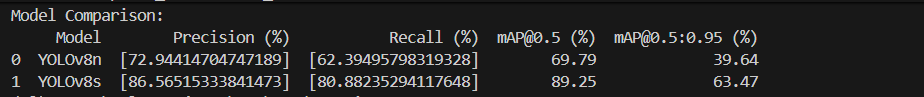
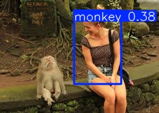
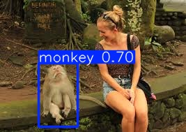

## ⚙️ Setup Instructions

1️⃣ Clone the repository

git clone https://github.com/your-username/your-repo-name.git
cd your-repo-name

2️⃣ Install dependencies

pip install -r requirements.txt

3️⃣ Run inference / comparison

python main.py

## 📊 Model Comparison Results

This project compares the performance of different YOLOv8 models
for monkey detection on the same dataset.

### Models Compared
- YOLOv8n (Nano)
- YOLOv8s (Small)

### 📈 Performance Metrics

### 🧠 Observations
- YOLOv8s significantly outperforms YOLOv8n across all evaluation metrics.
- YOLOv8s achieves higher precision and recall, resulting in better detection reliability.
- The mAP improvement indicates stronger overall localization and classification performance.

---

## 📸 Prediction Comparison

### YOLOv8n Detection

### YOLOv8s Detection

### ✅ Conclusion
YOLOv8s provides substantially better detection performance compared to YOLOv8n,
making it the preferred model for accuracy-focused applications.

YOLOv8n remains useful for lightweight or real-time scenarios where computational
efficiency is more important than peak accuracy.